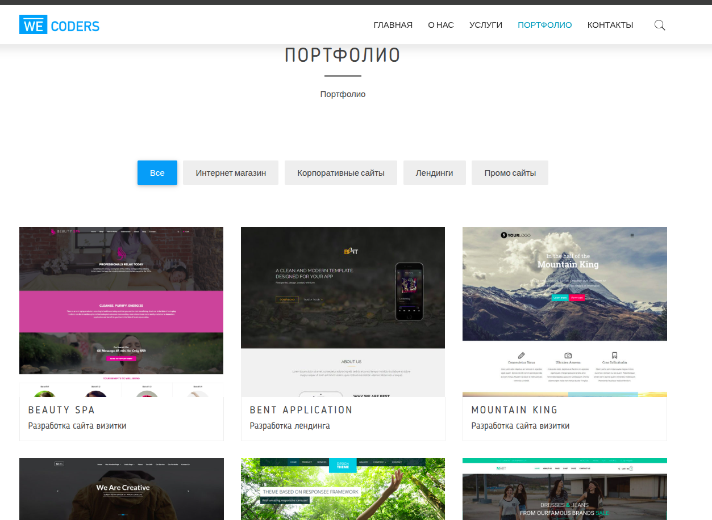

# Bitrix-Tube

[](https://www.php.net/) [](https://www.1c-bitrix.ru/) [](https://developer.mozilla.org/en-US/docs/Web/HTML) [](https://developer.mozilla.org/en-US/docs/Web/CSS) [](https://developer.mozilla.org/en-US/docs/Web/JavaScript) [](https://httpd.apache.org/)

---

## 📋 Описание

**Bitrix-Tube** — учебный проект на базе CMS **1C-Bitrix**.  
Проект имеет:

- кастомный шаблон сайта,
- структуру навигации (меню),
- основные публичные страницы (главная, 404, About и др.),

Цель: практика с шаблонами, компонентами Bitrix, меню и правами доступа.

---

## 🚀 Установка и запуск
1.  Убедитесь, что у вас установлен PHP (версия 7.4 или выше).
2.  Клонируйте репозиторий:
    ```bash
    git clone https://github.com/Maxim-Belyi/bitrix-tube.git
    cd bitrix-tube
    ```
---

## ✔️ Требования

- **PHP** версии, поддерживаемой Bitrix (рекомендуется 7.4+ или 8.x)
- **CMS 1C-Bitrix** (локальная или серверная установка)
- Веб-сервер (Apache / Nginx)
- База данных (MySQL или другая, используемая в Bitrix)

